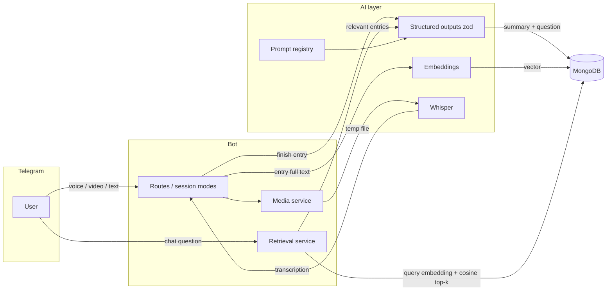

# Euphoria — AI Journaling Companion for Telegram

[](https://github.com/nikitacometa/euphoria-ai/actions/workflows/ci.yml)
[](LICENSE)

A Telegram bot that turns journaling into a conversation. Users write, speak, or record video; the bot transcribes, reflects back a summary with a thought-provoking question, and lets them chat with their own journal history through retrieval-augmented generation.

## Features

- **Multimodal entries** — text, voice, and video notes; audio is transcribed with Whisper
- **AI reflection** — every finished entry gets a one-sentence summary and a reflection question (structured LLM output, schema-validated)
- **Chat with your journal** — ask questions about your past; answers are grounded in your most relevant entries via embedding-based retrieval
- **Daily analysis** — one-tap insight into today's entries, mood, and patterns
- **Bilingual** — English and Russian UI with runtime-editable texts and a small admin panel
- **Personalized** — onboarding builds a profile (parsed from free-form voice/video bio with a structured-output extraction) that grounds every prompt

## How the AI pipeline works



**Retrieval-augmented chat.** When an entry is completed, its full text is embedded (`text-embedding-3-small`) and stored on the entry document. A chat question embeds the query, scores the user's entries by cosine similarity, and sends only the top-k (chronologically reordered) to the model — instead of stuffing the entire journal into the context window. Legacy entries without vectors fall back to recency, and a failed embedding call degrades gracefully to recent entries so chat never breaks. `npm run backfill-embeddings` vectorizes pre-existing entries.

**Why brute-force cosine and not a vector database?** A journal corpus is per-user and small (hundreds of entries, not millions). An O(n) scan over in-document vectors is a few milliseconds, adds zero infrastructure, and keeps the data model trivial. The retrieval service is isolated in `src/services/journal-retrieval.ts`; swapping the scan for MongoDB Atlas `$vectorSearch`, Qdrant, or pgvector when scale demands it is a one-file change.

**Structured outputs.** All JSON-shaped model calls (follow-up questions, entry summaries, bio parsing) go through one typed helper (`src/ai/structured.ts`) built on the OpenAI SDK's `parse` API with zod schemas — no hand-rolled `JSON.parse` with regex fallbacks. Refusals and schema mismatches throw; callers own their fallbacks.

**Prompt management.** Every system prompt lives in `src/ai/prompts.ts` — one persona, one source of truth, no copies drifting across call sites.

**Evals.** `npm run eval` runs a golden set of journal entries (short/long, EN/RU, edge cases) through the real prompts and asserts structural invariants: question count and length limits, insight bullet format, fallback detection. An optional `--judge` flag adds an LLM-as-judge persona-consistency score. Evals are a local tool by design — they spend API tokens, so they are not wired into CI.

**Cost and latency.** Embeddings are computed once per entry at completion time (amortized, off the hot path). Retrieval caps prompt size regardless of journal length, keeping chat token cost roughly constant as the journal grows. Transcription and generation calls show a progress indicator that is always cleaned up, including on failure.

## Architecture

```
src/
├── main.ts                  # composition root: connect DB, start bot (+ admin UI)
├── config.ts                # zod-validated environment (fail-fast on boot)
├── bot/
│   ├── index.ts             # bot wiring: session, middleware, routes, error handler
│   ├── context.ts           # session mode as a discriminated union
│   ├── middleware/user.ts   # resolves ctx.user once per update; private chats only
│   └── routes/              # one module per feature (onboarding, entry, chat, ...)
├── services/                # orchestration: media download/transcribe, retrieval
├── ai/                      # OpenAI client, prompt registry, structured outputs,
│                            # embeddings, transcription
├── database/                # mongoose models + data-access functions
├── utils/                   # logger, localization, HTML escaping, entry text
└── admin/                   # express admin panel for localized texts (basic auth)
```

Design decisions worth calling out:

- **Session state is a discriminated union** (`idle | onboarding | journal_entry | journal_chat | settings`), so conflicting mode flags are unrepresentable and every transition replaces the whole mode.
- **User content is HTML-escaped at the boundary** — localization templates escape all injected values by default; trusted markup must be passed explicitly as `{ raw }`.
- **Media handling is one implementation** — download → transcribe → always delete the temp file (`try/finally`), used by every voice/video path.
- **Errors surface, never silently disappear** — a global bot error handler keeps polling alive; transcription failures throw typed errors instead of saving apology strings into journal content.

## Getting started

Prerequisites: Node.js ≥ 20, Docker (for MongoDB), a Telegram bot token from [@BotFather](https://t.me/BotFather), an OpenAI API key.

```bash
git clone https://github.com/nikitacometa/euphoria-ai.git
cd euphoria-ai
npm install
cp .env.example .env   # fill in TELEGRAM_API_TOKEN, OPENAI_API_KEY, MONGODB_PASSWORD
```

Run everything in Docker:

```bash
make up        # bot + MongoDB
make logs      # follow bot logs
```

Or run the bot locally against the dockerized database:

```bash
make up        # MongoDB (the bot container too; stop it if you want only the DB)
npm run dev    # tsx watch mode
```

Other Makefile targets: `make down`, `make clean` (wipes DB volume), `make db-shell`, `make db-ui` (Mongo Express on localhost).

## Configuration

| Variable | Required | Default | Purpose |
|----------|----------|---------|---------|
| `TELEGRAM_API_TOKEN` | yes | — | Bot token |
| `OPENAI_API_KEY` | yes | — | OpenAI API access |
| `GPT_VERSION` | no | `gpt-4o` | Chat model |
| `EMBEDDING_MODEL` | no | `text-embedding-3-small` | Embedding model for retrieval |
| `MONGODB_*` | no | see `.env.example` | Host/port/user/password/database (or a full `MONGODB_URI`) |
| `LOG_LEVEL` | no | `3` | 0=none … 5=trace |
| `ADMIN_TELEGRAM_IDS` | no | — | Comma-separated ids allowed to use `/updatetext` |
| `ENABLE_ADMIN_INTERFACE` | no | `false` | Start the localization admin panel |
| `ADMIN_PASSWORD` | when admin enabled | — | HTTP Basic auth for the panel |
| `ADMIN_HOST` / `ADMIN_PORT` | no | `127.0.0.1:3000` | Panel binding (loopback by default) |

Configuration is validated with zod at startup; the process exits with a readable error report if anything required is missing.

## Development

```bash
npm run typecheck   # tsc, strict
npm run lint        # eslint (typescript-eslint)
npm test            # vitest unit tests
npm run eval        # prompt eval harness (spends OpenAI tokens)
npm run build       # compile to dist/
```

CI (GitHub Actions) runs typecheck, lint, tests, and build on every push and pull request.

## Roadmap

- Per-user timezone for the "Analyze Today" day boundary (currently server-local)
- Streaming responses in chat mode via incremental message editing
- Language-aware AI responses driven by the user's UI language
- Swap in a dedicated vector index (Atlas `$vectorSearch` / Qdrant) if per-user corpora outgrow the linear scan

## License

MIT — see [LICENSE](LICENSE).
